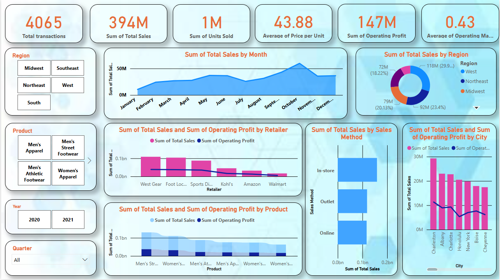

# Sales Performance Dashboard 📊

A dynamic and interactive Power BI dashboard analyzing sales performance across different regions, products, retailers, and methods.

## 📌 Key Insights:
- Total Sales: **394M**, Total Transactions: **4065**
- Operating Profit: **147M**, with an average margin of **0.43**
- Monthly trend analysis of sales and profit
- Region-wise and product-wise breakdown of sales and profitability
- Comparison of online, in-store, and outlet sales
- Retailer-wise and city-wise performance metrics

## 🔧 Tools Used:
- Power BI
- DAX & Data Modeling
- Data Cleaning in Power Query
- Visualization techniques using custom and native visuals

## 📁 Files Included:
- `Sales Report.pbix` - Main Power BI file
- `Sales Report.csv` - Dataset used
- `SalesDashBoard.png` - Dashboard snapshot

## 📸 Preview

## 💡 How to Use
1. Clone the repository
2. Open the Power BI desktop
3. Load `Sales Report.csv`
4. Recreate visuals using provided screenshot
---

✅ Feel free to fork, star, or reach out for collaboration!
